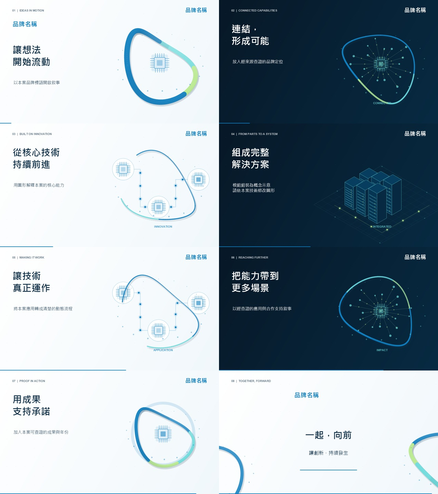

# Motion Graphics Video

A Codex skill for producing branded motion-graphics films with researched facts,
official logos and colors, synchronized animation, and an original EDM soundtrack.

動態圖形影片製作 Skill：整合品牌研究、分鏡、動畫、EDM 配樂、影音同步與成品檢查。
Skill instructions and production references are written in Traditional Chinese.

## Sourced company explainer — TSMC

[](https://bigtongue5566.github.io/?demo=tsmc-explained)

**[Watch the 90-second film with sound →](https://bigtongue5566.github.io/?demo=tsmc-explained)** ·
[逐段資料來源](https://bigtongue5566.github.io/?demo=tsmc-explained#references) ·
[Original soundtrack](https://bigtongue5566.github.io/?demo=tsmc-explained-music) ·
[Reproducible source](examples/tsmc-explained)

An independent, unofficial introduction to TSMC, with original conceptual wafer,
transistor and packaging animation and a new 124 BPM D minor Dub Techno score.
Reported 2025 facts and N2 production timing are linked to official primary sources
in the film, the player page, [SOURCES.md](examples/tsmc-explained/SOURCES.md),
and the machine-readable [claim ledger](examples/tsmc-explained/claims.json).

No company logo, corporate photo, official chart, website screenshot, company
footage or third-party recording is included. The company name identifies the
subject in ordinary type. This work is not sponsored or endorsed by TSMC.
Attribution does not grant rights or guarantee against legal claims; see the
[actual materials and rights record](examples/tsmc-explained/RIGHTS.md).

## Original demo

[](https://bigtongue5566.github.io/?demo=form-and-frequency)

**[Watch the 90-second film with sound →](https://bigtongue5566.github.io/?demo=form-and-frequency)** ·
[Explore this Skill on Skill Showcase](https://bigtongue5566.github.io/?skill=motion-graphics-video)

An original 1080p motion study with procedural geometry and a synchronized
Future Bass soundtrack. The shared [production example](https://github.com/bigtongue5566/edm-music-production/tree/main/examples/form-and-frequency)
includes its render source, MIDI, media checks, and [sources and licenses](https://github.com/bigtongue5566/edm-music-production/blob/main/examples/form-and-frequency/RIGHTS.md).


## More original Demos

| Work | Music | Film | Standalone soundtrack | Reproducible source |
| --- | --- | --- | --- | --- |
| Digital Pulse / 數位脈動 | 60 sec · 172 BPM · Drum & Bass | [Watch](https://bigtongue5566.github.io/?demo=digital-pulse) | [Listen](https://bigtongue5566.github.io/?demo=digital-pulse-music) | [Project](https://github.com/bigtongue5566/edm-music-production/tree/main/examples/digital-pulse) |
| Neon Drift / 霓虹漫遊 | 60 sec · 132 BPM · UK Garage | [Watch](https://bigtongue5566.github.io/?demo=neon-drift) | [Listen](https://bigtongue5566.github.io/?demo=neon-drift-music) | [Project](https://github.com/bigtongue5566/edm-music-production/tree/main/examples/neon-drift) |

Each work has a new musical arrangement and original procedural visuals,
documented sources, MIDI, editable code, and checks of the finished media.

## Refreshed multi-style showcase

The four current films and soundtracks were recomposed and re-rendered on 2026-10-10:
Future Bass (148 BPM), Drum & Bass (172 BPM), UK Garage (132 BPM), and Dub Techno (124 BPM).
Their source packages retain explicit extended chords, notes, actual synthesis/automation,
MIDI and finished-media QC. These custom example implementations are separate from the
audio starter's three selectable presets. The films follow the new audio and actual kick events.

## Starter preview



The storyboard shows the starter's vector scenes. Its example text illustrates the
workflow; replace it with researched content for each actual brand.

## What it includes

- A workflow for checking company facts, news, official logos, palettes, and source provenance.
- Animated vector scenes: brand opening, connected networks, modular assembly, flowing paths,
  metrics, and a brand closing.
- A configurable melodic-house score with chord-following melodies, bass, drums,
  builds, breaks, chapter accents, and kick-triggered volume ducking.
- Editable MIDI, independent AAC background music, a mastered WAV, and a final H.264/AAC MP4.
- Direct checks of the encoded movie: duration, frame count, resolution, frame rate,
  audio format, loudness, true peak, mono compatibility, and fading.

The starter defaults to 90 seconds, 1080p, 30 fps, and 120 BPM. These are adjustable
starting values. Adapt the layout, narration, visuals, and music to the actual brief.

## Install as a Codex skill

Clone this repository into your Codex skills directory. For the standard Windows
location used by this project:

```powershell
git clone https://github.com/bigtongue5566/motion-graphics-video.git "$env:USERPROFILE\.codex\skills\motion-graphics-video"
```

If you use a custom `CODEX_HOME`, place the repository in its `skills/motion-graphics-video`
directory. Use an empty destination to preserve an existing installation.

Invoke it with a prompt such as:

```text
用 $motion-graphics-video 製作一支 90 秒的公司介紹影片，
採用官方 LOGO 與品牌配色，搭配旋律型 EDM，並查證公司資訊。
```

## Run the starter directly

Python 3.12 and `uv` are used in the tested Windows setup. The dependencies include
NumPy, SciPy, Pillow, Skia, Mido, and imageio-ffmpeg. FFmpeg is supplied by
imageio-ffmpeg; a separate system installation is unnecessary.

From the repository root:

```powershell
python -X utf8 scripts/init_project.py --project ../my-brand-film
uv venv ../my-brand-film/work/.venv --python 3.12
uv pip install --python ../my-brand-film/work/.venv/Scripts/python.exe -r ../my-brand-film/work/requirements.txt
```

Edit `../my-brand-film/project.json` to set the brand, official logo paths, colors,
copy, scenes, timing, and music. Add the relevant source records to
`../my-brand-film/work/sources.json`.

```powershell
../my-brand-film/work/.venv/Scripts/python.exe -X utf8 ../my-brand-film/work/render_video.py preview --project ../my-brand-film
../my-brand-film/work/.venv/Scripts/python.exe -X utf8 ../my-brand-film/work/compose_edm.py --project ../my-brand-film
../my-brand-film/work/.venv/Scripts/python.exe -X utf8 ../my-brand-film/work/render_video.py render --project ../my-brand-film
../my-brand-film/work/.venv/Scripts/python.exe -X utf8 ../my-brand-film/work/finish_video.py --project ../my-brand-film
```

Use the corresponding `venv/bin/python` path on other platforms and supply suitable
fonts in `project.json`. Windows defaults use Microsoft JhengHei and Arial.
The included visual layout is 16:9; redesign the composition for a portrait film.

The initializer also accepts `--duration`, `--bpm`, `--size`, `--fps`, and `--name`.
It refuses to overwrite existing project files.

## Outputs and configuration

Finished files are written to the generated project's `outputs/` directory:

| File | Purpose |
| --- | --- |
| `<slug>.mp4` | Full motion-graphics film with music and chapter metadata |
| `<slug>-bgm.m4a` | Independent soundtrack |
| `<slug>-music.mid` | Editable note and instrument tracks |
| `<slug>-storyboard.jpg` | Scene composition overview |
| `<slug>-poster.jpg` | Film poster |
| `<slug>-qc.json` | Measurements from the encoded final film |
| `<slug>-production.md` | Production notes and supplied source references |

`work/` contains the silent picture track, floating-point mix, 24-bit audio master,
logs, and actual encoded frame samples. Keep `work/picture.mp4` when revising only
the soundtrack.

- [Skill instructions](SKILL.md)
- [Project configuration](references/project-schema.md)
- [Visual research and design](references/visual-production.md)
- [EDM composition and mixing](references/edm-production.md)
- [Local production pipeline](references/local-pipeline.md)

## Instrument sources and validation

The default keyboard and electronic instruments are synthesized by the included
code. For a sampled piano, configure a local SoundFont and a compatible FluidSynth
executable in `music.soundfont` and `music.fluidsynth`. Record the source and license.
External sound libraries are separate downloads and are not bundled here.

The workflow has been exercised on Windows with an 8-second, 15 fps synthesized
version and a 7.3-second, 30 fps version at 124 BPM in D major with a sampled piano.
Both completed the animation, score, mastering, muxing, and encoded-media checks.

Signal measurements and chord-note checks help find production errors. Listening
and visual review remain necessary to assess musical and design quality.

## License

The code, original vector primitives, synthesis code, and skill documentation in
this repository are available under the [MIT License](LICENSE).
External dependencies, fonts, SoundFonts, company logos, and trademarks retain
their respective licenses and ownership. No company logos or sampled instrument
banks are included in this repository.
